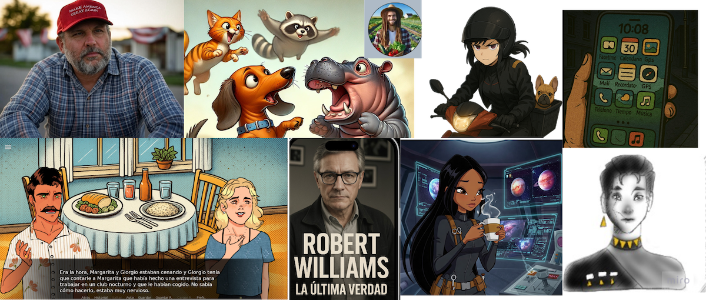

# Proyectos de Storytelling 2025

Digital Storytelling / Narraciones y creatividad en ecosistema digital 2024/25

 
 

Evaluación FINAL de los proyectos: https://forms.gle/micjMoPCKtSJ8jQT9

## Historias Ficción/Cyberpunk

- (F1) **Operación Huesitos** 
    * Github: https://github.com/luzarcsan/huesitos
    * INteractivo: https://app.lumi.education/run/5Isym-
  
- (F2) **Beowulf d' Eón**
  * Github: https://github.com/joseantoniorae/El_ladron_de_ideas
  * Interactivo: https://app.lumi.education/api/v1/run/h2vn7e/embed
  
- (F3) **ZEKKE RINKU**
  * Github: [https://github.com/bysergiio/my_storytelling](https://github.com/bysergiio/zekke-rinku) 
  * Interactivo:  

- (F4) **Robert Williams**
   * Github: [https://github.com/hugoolivencia/my_storytelling](https://github.com/hugoolivencia/RobertWilliams)
   * Interactivo:

## Historias Reality (tribus urbanas) 

- (R1) **Melody & Cornelius**
  * https://github.com/clarasb31/melody_y_cornelius
  * Interactivo: https://app.lumi.education/h5p/qu-tipo-de-ladrn-eres-oabmgv
    
   
- (R2) **Sorprendida**
  * https://github.com/carmeenlopez/sorprendida
  * Interactivo: https://app.lumi.education/run/rVaHHh

 
- (R3) **MANOLO** 
  * https://github.com/maytelulo/my_storytelling
  * Interactivo: https://h5p.org/node/1523365
  * Banner/Teaser: [Échale un ojo al móvil de Enzo (figma)](https://www.figma.com/proto/40WygI7XnHocJM2rtfhXZp/MANOLO?node-id=42-353&t=uXLXJag58EhSP4LB-1&scaling=scale-down&content-scaling=fixed&page-id=0%3A1&starting-point-node-id=34%3A757)
  * Storytelling: Sumérgete en el mundo de Manolo y el aprendizaje que le da a su sobrino Enzo: [arcweave](https://arcweave.com/app/project/nwEpK7Pl4a?board=630fdb8a-48d6-473e-9974-2460f7eb2b41&scale=0.337500&coords=-16586.51270027648,-16770.030878427864)
  * Conoce la historia de Manolo y Enzo en Renpy: https://manolocrea.itch.io/manolo

 
- (R4) **Magullón**
   * Github: https://github.com/adelaidanavas/MAGULLON
   * Interacivo: 
     

## Historias Comic (animados) 

- (C1) **Gio, por amor todo**
  *  Github https://github.com/daniiitms/my_storytelling
  *  Interactivo: https://app.lumi.education/h5p/qu-personaje-eres-de-gio-por-amor-todo-b2pyb5

- (C2) **Proyecto Verónica**: Guerra Entre Dos Mundos
  * Github: https://github.com/marinarivas/Proyecto_Veronica
  * Interactivo:  https://app.lumi.education/h5p/descubre-si-escaparas-del-juicio-de-vernica-sols-aguantaras-viv-el1zg7
 
- (C3) **Cafeína**
  * https://github.com/fulsangmaria/cafeina
  * Interactivo:  https://cafeina.h5p.com/content/1292535668756321327
  * INteractivo2: https://ugr2.h5p.com/content/1292535033125887727
 
- (C3) **Cafeína2**
  * [arcweave](https://arcweave.com/app/project/g16kJyxEYP?board=630fdb8a-48d6-473e-9974-2460f7eb2b41&scale=0.744216&coords=-12944.086120310334,-15111.539026989654)
  * [Teaser Interactivo Figma](https://www.figma.com/proto/QRGtPQUTKB3yJZRAMvIpUj/Sin-t%C3%ADtulo?node-id=1-1225&p=f&t=xkMl485If53QNYmU-1&scaling=min-zoom&content-scaling=fixed&page-id=0%3A1&starting-point-node-id=1%3A1225&show-proto-sidebar=1)
 
  
  

-----

Mayo 2025 

[Creatividad e Innovación Audiovisual, 1ª edición](http://github.com/CRIAv)

[Facultad de Comunicación y Documentación](http://fcd.ugr.es)

Universidad de Granada

